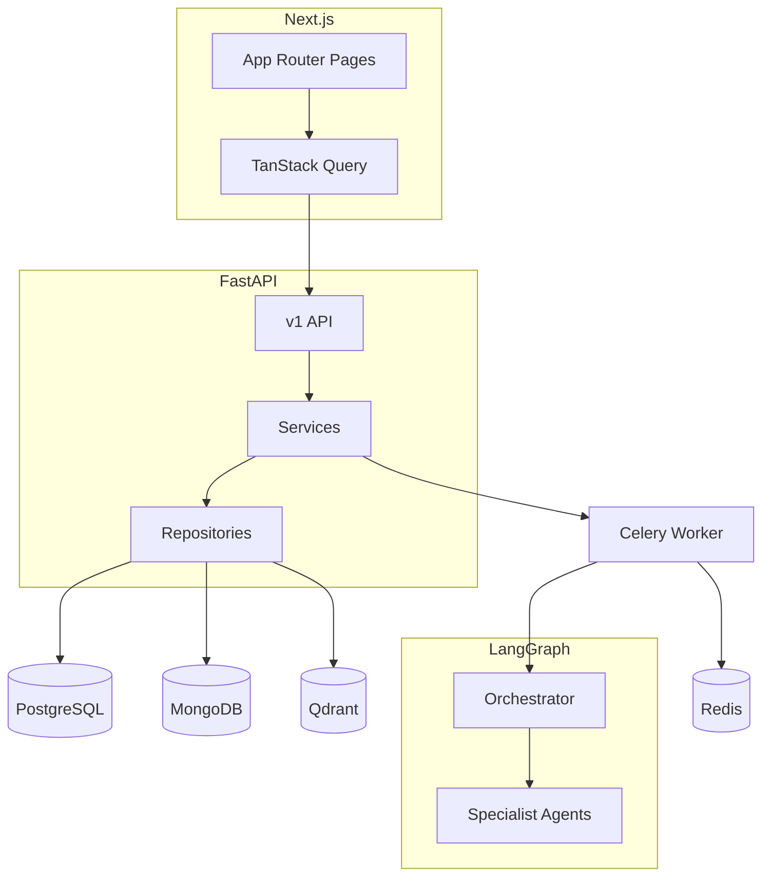

# Orion

Production-grade multi-agent enterprise intelligence and workflow automation platform.

## Quick start

```bash
cp .env.example .env
# Free path: install Ollama, run `ollama pull llama3.2` and `ollama pull nomic-embed-text`,
# then from Docker set OLLAMA_BASE_URL=http://host.docker.internal:11434 (see docs/FREE_STACK.md).
make dev
```

- API: http://localhost:8000/docs
- Frontend: http://localhost:3000

**Zero-cost stack:** Orion defaults to **local Ollama** (chat + embeddings) and **DuckDuckGo** web search—no paid APIs required. Optional OpenAI / Anthropic / Tavily are supported if you add keys. Details: [`docs/FREE_STACK.md`](docs/FREE_STACK.md).

See [Architecture](#architecture) below for the system diagram.

## API surface

All JSON responses use the `{ success, data, error, meta }` envelope implemented in
[`backend/app/schemas/common.py`](backend/app/schemas/common.py).

Primary route groups:

- `/api/v1/auth` — register, login, refresh, logout (HTTP-only cookies + bearer-ready tokens)
- `/api/v1/workflows` — create/list/detail/delete + SSE stream on `/{id}/stream`
- `/api/v1/documents` — URL/text/PDF ingestion backed by Celery + Qdrant
- `/api/v1/search` — semantic and hybrid vector search
- `/api/v1/analytics` — usage stats and admin-only audit log feed
- `/api/v1/admin` — org user directory, role updates, API key lifecycle

## Continuous integration

GitHub Actions workflow [`.github/workflows/ci.yml`](.github/workflows/ci.yml) runs Ruff, Black, Mypy,
and Pytest for the backend plus `next lint` and `next build` for the frontend on every push/PR.

## Makefile

| Target | Description |
|--------|-------------|
| `make dev` | Build and start all services with Docker Compose |
| `make down` | Stop and remove volumes |
| `make migrate` | Run Alembic migrations in the API container |
| `make test` | Run backend pytest |
| `make lint` | Ruff, Black, mypy on backend |

## Architecture



## Deploying the frontend on Vercel

Yes — the Next.js app in [`frontend/`](frontend/) fits the [Vercel](https://vercel.com) hobby (free) tier.

1. **Create a Vercel project** from this repo and set **Root Directory** to `frontend` (or import only the `frontend` folder).
2. **Environment variable** (Production + Preview as needed):
   - `NEXT_PUBLIC_API_URL` — full URL of your deployed FastAPI origin, e.g. `https://api.yourdomain.com` (no trailing slash). The browser uses this for `fetch` and SSE.
3. **Backend CORS** — in the API environment, set `CORS_ORIGINS` to include your Vercel URL(s), e.g. `https://your-app.vercel.app` (comma-separate multiple origins).
4. **Cookies / auth** — for production, serve the API over **HTTPS** and set `COOKIE_SECURE=true` on the backend so auth cookies work from the Vercel origin.
5. **API + worker** — Vercel only hosts the frontend; Postgres, MongoDB, Redis, Qdrant, FastAPI, and Celery must run elsewhere (see [`docs/FREE_STACK.md`](docs/FREE_STACK.md) and prior deploy notes).

## License

Proprietary — portfolio / demonstration project.
