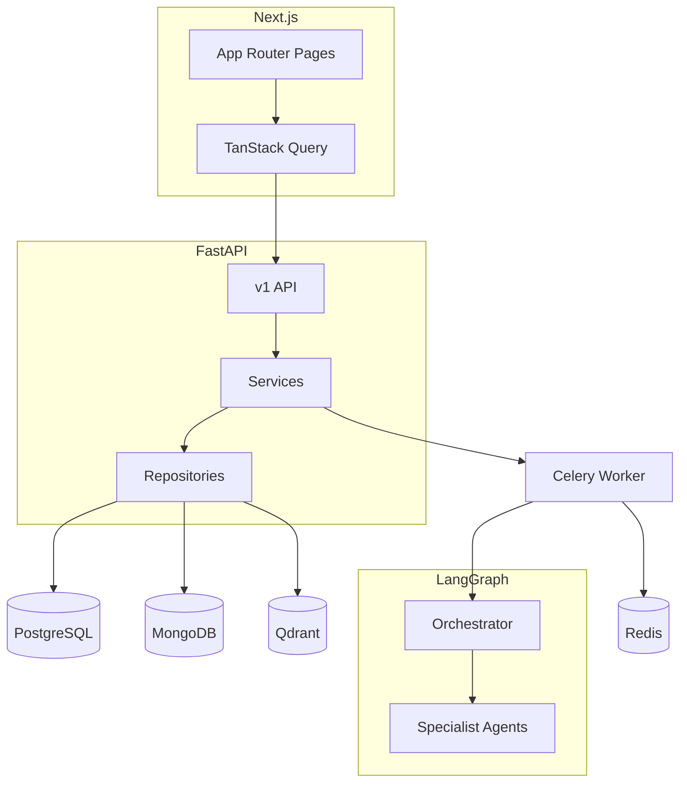

# Orion

Production-grade multi-agent enterprise intelligence and workflow automation platform.

## Quick start

```bash
cp .env.example .env
# Set SECRET_KEY, OPENAI_API_KEY (or Anthropic), and optional Tavily key
make dev
```

- API: http://localhost:8000/docs
- Frontend: http://localhost:3000

See [Architecture](#architecture) below for the system diagram.

## API surface

All JSON responses use the `{ success, data, error, meta }` envelope implemented in
[`backend/app/schemas/common.py`](backend/app/schemas/common.py).

Primary route groups:

- `/api/v1/auth` — register, login, refresh, logout (HTTP-only cookies + bearer-ready tokens)
- `/api/v1/workflows` — create/list/detail/delete + SSE stream on `/{id}/stream`
- `/api/v1/documents` — URL/text/PDF ingestion backed by Celery + Qdrant
- `/api/v1/search` — semantic and hybrid vector search
- `/api/v1/analytics` — usage stats and admin-only audit log feed
- `/api/v1/admin` — org user directory, role updates, API key lifecycle

## Continuous integration

GitHub Actions workflow [`.github/workflows/ci.yml`](.github/workflows/ci.yml) runs Ruff, Black, Mypy,
and Pytest for the backend plus `next lint` and `next build` for the frontend on every push/PR.

## Makefile

| Target | Description |
|--------|-------------|
| `make dev` | Build and start all services with Docker Compose |
| `make down` | Stop and remove volumes |
| `make migrate` | Run Alembic migrations in the API container |
| `make test` | Run backend pytest |
| `make lint` | Ruff, Black, mypy on backend |

## Architecture



## License

Proprietary — portfolio / demonstration project.
